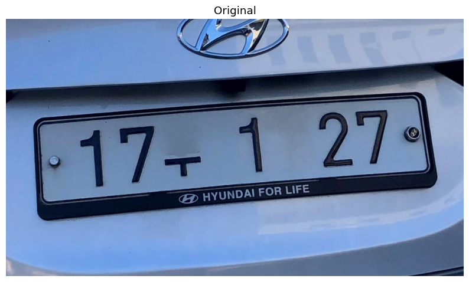
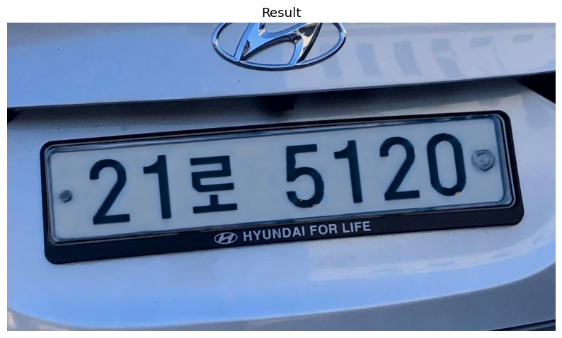

# [Research] Deep Learning-based Virtual License Plate Synthesis
**딥러닝 기반 가상 차량 번호판 합성을 통한 개인정보 보호 및 이미지 데이터셋 확보** 

차량 이미지 내 번호판 정보를 단순히 가리는 방식(Blurring, Mosaic)에서 벗어나, 이미지의 시각적 품질과 스타일을 유지하면서 번호판 정보를 자연스럽게 비식별화하는 End-to-End 파이프라인에 대한 연구입니다.

---

## 🏗️ 시스템 파이프라인 (System Pipeline)
세 가지 핵심 모델이 유기적으로 연결된 다단계 파이프라인으로 구성됩니다. 

### 1. 번호판 영역 탐지 (Detection) 
* **Model**: YOLOv5s (Small) 
* **Dataset**: CCPD(4,000장) 및 직접 수집한 한국 번호판(571장) 혼합 학습 
* **Performance**: **mAP@0.5 기준 0.995** 달성 

### 2. 꼭짓점 회귀 및 원근 보정 (Regression & Perspective Transform) 
* **Model**: ResNet18 기반 Regression Model 
* **Logic**: 번호판의 네 꼭짓점 좌표를 예측하여 3차원 원근 변환 수행 
* **Performance**: **Mean IoU 0.9381**, **MED 0.0185** (좌표 오차 2% 이내) 

### 3. 스타일 전이 및 색상 보정 (Synthesis & Correction) 
* **Model**: AdaIN (Adaptive Instance Normalization) 
* **Color Correction**: Reinhard Color Transfer 기법 적용 
* **Goal**: 가상 번호판에 원본의 질감, 조명, 색조를 자연스럽게 입힘 

---

## 📈 실험 결과 (Experimental Results)

| 평가 단계 | 주요 지표 | 결과 수치 |
| :--- | :--- | :--- |
| **Detection** | mAP@0.5 | **0.995** | 
| **Regression** | Mean IoU | **0.9381** |
| **Synthesis** | **LPIPS** | **0.0829** |

### 시각적 지각 유사도 (LPIPS)
단순 픽셀 오차가 아닌, 인간의 시각적 인지와 상관성이 높은 **LPIPS(Learned Perceptual Image Patch Similarity)** 지표를 통해 자연스러움을 정량적으로 평가했습니다. 

| 원본 입력 | 결과 |
| :---: | :---: |
|  |  |

**실제로는 보호되지 않은 원본 사진을 넣었을 때의 결과입니다.**

---

## 🧪 기술적 성찰 및 한계점 (Reflections)
본 프로젝트는 실험을 통해 다음과 같은 기술적 개선 과제를 도출하였습니다. 

* **광학적 일관성**: 현재 시스템은 강한 그림자가 진 상황에서 배경과의 광학적 이질감이 발생하는 한계가 있습니다. 
* **그림자 처리**: 스타일 전이 과정에서 전체 명암이 평균적으로 어둡게 표현되는 현상을 확인하였습니다. 
* **향후 연구**: 그림자 검출 및 복원 네트워크를 추가 통합하여 모든 조명 환경에서의 범용성을 강화할 예정입니다. 

---

## 🛠 기술 스택 (Tech Stack)
* **Language**: Python
* **Framework**: PyTorch
* **Models**: YOLOv5, ResNet18, AdaIN
* **Libraries**: OpenCV, Matplotlib

---

## ⚠️ 실행 환경 안내 (Disclaimer)
특정 버전의 CUDA Toolkit 및 코랩 환경에 프리인스톨된 라이브러리에 의존성을 가지고 있어, 일반 로컬 환경에서는 빌드 및 런타임 에러가 발생할 수 있습니다.

---

## 📄 논문 정보
* [딥러닝 기반 가상 차량 번호판 합성을 통한 개인정보 보호 및 이미지 데이터셋 확보 ](https://drive.google.com/file/d/15XxiSRSt4lwgTPwhrA0aEg4voi0tDj50/view?usp=sharing)
