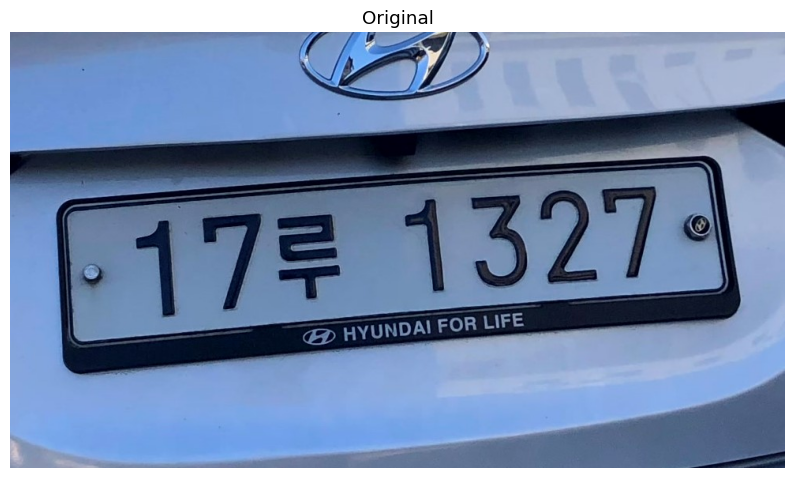

# License Plate De-identification

YOLOv5, ResNet18, AdaIN을 활용한 차량 번호판 비식별화 시스템

## 기술 스택
- Python, PyTorch, OpenCV
- YOLOv5: 번호판 탐지
- ResNet18: 꼭짓점 회귀
- AdaIN: 스타일 전이

## 예시 결과

| 입력 이미지 | 비식별화 결과 |
|-------------|----------------|
|  |  |
